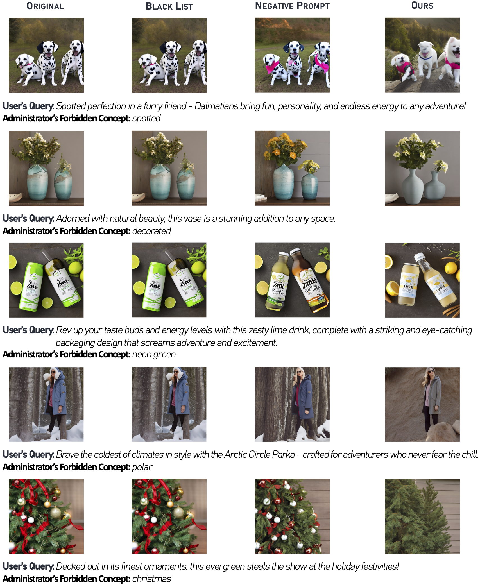

# ORES

Thanks for your interest in our work, ORES: Open-vocabulary Responsible Visual Synthesis. We release our code, checkpoint, and dataset here.

## Cite ORES!

```
@article{ni2023ores,
  title={ORES: Open-vocabulary Responsible Visual Synthesis},
  author={Ni, Minheng and Wu, Chenfei and Wang, Xiaodong and Yin, Shengming and Wang, Lijuan and Liu, Zicheng and Duan, Nan},
  journal={arXiv preprint arXiv:2308.13785},
  year={2023}
}
```

## ORES Samples




## Our FIN framework

### Environment

We follow Stable Diffusion to set up environment.yaml.

```
conda env create -f environment.yaml
conda activate ldm
```

### Quick Start

We design a WebUI for an out-of-the-box start. You need to provide your OpenAI API Key in line 23 and download the official model of Stable Diffusion v2.1 from this [url](https://huggingface.co/stabilityai/stable-diffusion-2-1/blob/main/v2-1_768-ema-pruned.ckpt) to ```TIN/checkpoints/v2-1_768-ema-pruned.ckpt```.

To start up WebUI, use
```
cd TIN
python ui.py
```

### Re-train Learnable Instruction

We also provide the training code for Learnable Instruction. You need to provide your OpenAI API Key in line 9.

To start training, use
```
cd Instruction
python instruction.py
```

## Dataset

We release this dataset under an MIT license. Refer to ```Dataset/ORES_data.txt``` for details.

## Reproducibility

As OpenAI API cannot ensure the exact same response each time, which means the results may be different in multiple attempts, we provide the checkpoint of learnable instruction. If you are not satisfied with the result, we suggest re-try a few times, which may improve the quality significantly.
